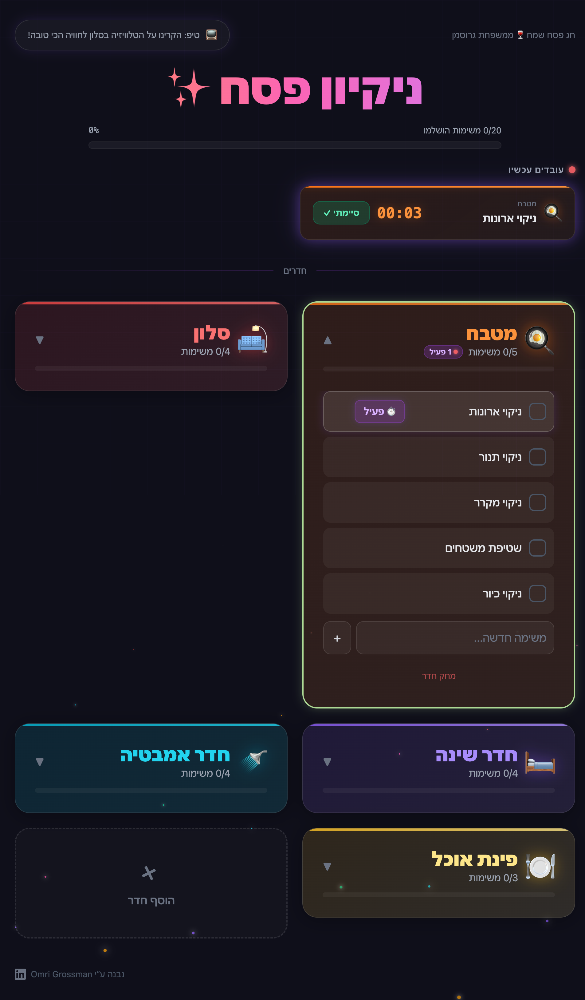
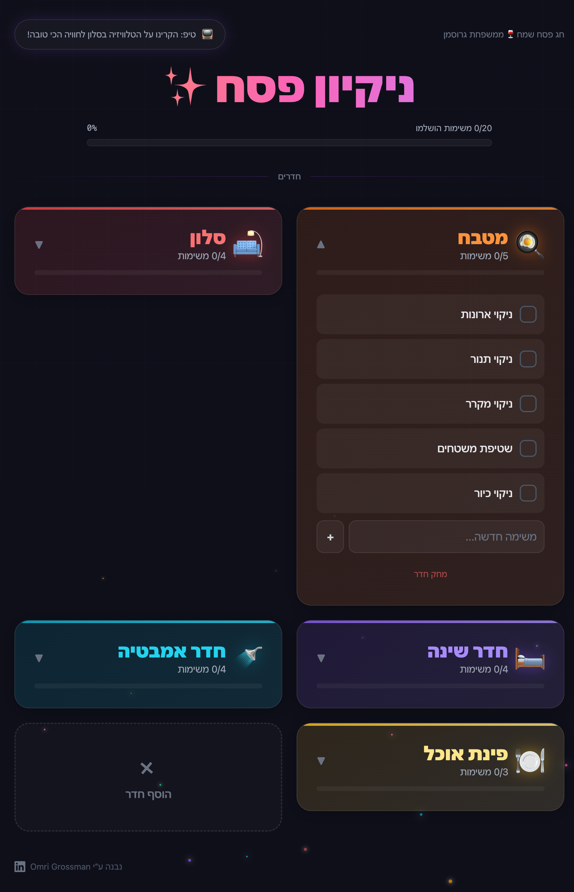

# ניקיון פסח ✨ — Passover Cleaning Tracker

A gamified Passover cleaning tracker built for families. Dark neon UI, sound effects, confetti celebrations, and a stopwatch to time your tasks. Designed to be projected on the living room TV for maximum fun.

**Live app:** [resilient-pegasus-f829ef.netlify.app](https://resilient-pegasus-f829ef.netlify.app)

## Screenshots

### Home — Room Grid


### Active Task with Stopwatch


### Room Expanded


## Features

- **Room-based task management** — 5 pre-loaded rooms (Kitchen, Living Room, Bedroom, Bathroom, Dining Room) with Hebrew task names
- **Stopwatch per task** — start timing a task, see it live at the top of the screen
- **Multiple concurrent tasks** — run stopwatches on several tasks at once
- **Sound effects** — pop, ding, whoosh, fanfare, thud — all synthesized via Web Audio API (no files)
- **Confetti celebrations** — canvas particle explosion when completing a timed task
- **Add/remove rooms** — custom rooms with emoji and color picker
- **Add/remove tasks** — per room, with completion tracking
- **Progress tracking** — per-room and overall progress bars
- **Completion time** — shows how long each task took after finishing
- **Dark neon theme** — vibrant colors, glowing accents, floating particles
- **TV optimized** — large fonts, big touch targets, RTL Hebrew support
- **Mobile friendly** — responsive grid, all controls accessible without hover
- **Persistent state** — everything saved to localStorage (survives refresh)
- **Analytics** — Mixpanel integration for page views and task events

## Tech Stack

- React 18 + TypeScript
- Vite
- Tailwind CSS 4
- Framer Motion
- Web Audio API
- Mixpanel
- Netlify (hosting)

## Getting Started

### Prerequisites

- Node.js 20+
- npm

### Install & Run

```bash
git clone https://github.com/OmriGM/passover.git
cd passover
npm install
npm run dev
```

Open [http://localhost:5173](http://localhost:5173) in your browser.

### Build for Production

```bash
npm run build
```

Output goes to `dist/`.

### Deploy to Netlify

```bash
npx netlify-cli deploy --prod --dir dist
```

## Project Structure

```
src/
  App.tsx                    # Main app — state management, view routing
  types.ts                   # TypeScript interfaces
  index.css                  # Tailwind imports + custom animations
  main.tsx                   # React entry point
  components/
    ActiveTaskCards.tsx       # Live stopwatch cards at the top
    AddRoomModal.tsx          # Modal for adding custom rooms
    CelebrationOverlay.tsx    # Confetti + victory text overlay
    Confetti.tsx              # Canvas confetti renderer
    RoomCard.tsx              # Expandable room card with task list
  data/
    defaultRooms.ts           # Pre-loaded rooms, tasks, colors, emojis
  hooks/
    useLocalStorage.ts        # Persistent state hook
    useSound.ts               # Web Audio API sound effects
    useStopwatch.ts           # Stopwatch logic
  lib/
    analytics.ts              # Mixpanel setup
    confetti.ts               # Particle system engine
```

## Made by

[Omri Grossman](https://www.linkedin.com/in/omri-grossman-58384511b/)

!חג פסח שמח 🍷
